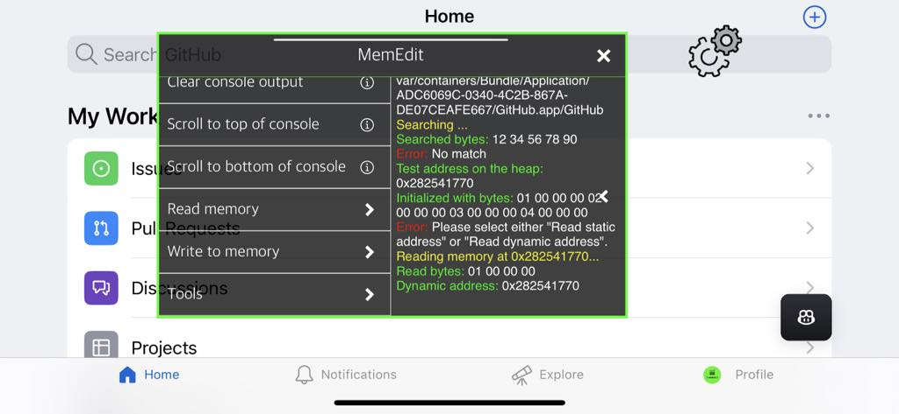

# MemEdit

A mod menu for iOS apps to view and edit memory at runtime and more. A great tool to make hacks.



---
## ✔️ Compatibility

- Should work at least on iOS 15–18
- Supports jailbroken environment (only tested on Dopamine 2.0 / rootless jailbreak on iOS 16.5)
- Supports non-jailbroken environment (even though writting to memory can be more restrictive). Only tested on iOS 16.5 and 18.3.2

## ⚙️ How to Install
### Jailbroken device:
Use the pre-compiled releases on this Github repository or install using my jailbreak repository https://xelahot.github.io/ directly on your device.

### Non-jailbroken device:
You must make a custom IPA of the app of you want to use MemEdit with. I use ESign to make it but you could use anything else like Sideloadly:
1. Get a decrypted version of you IPA (you can use TrollDecrypt, CrackerXI, flexdecrypt, bfdecrypt, etc.)
2. Add the "libXelahot.bundle" folder from https://github.com/xelahot/libXelahot to the "\*.app" folder of your decrypted IPA
3. Either add the "libXelahot.dylib" file from the releases of https://github.com/xelahot/libXelahot to the "\*.app" folder or "\*.app/Frameworks" folder of your decrypted IPA (it depends on the tool and/or options you use in your custom IPA making tool)
4. Either add the "MemEdit.dylib" file from the releases of this repository to the "\*.app" folder or "\*.app/Frameworks" folder of your decrypted IPA (it depends on the tool and/or options you use in your custom IPA making tool)
5. Either add the "CydiaSubstrate.framework" folder (it actually contains the ElleKit binary. I'll include that folder in the releases of https://github.com/xelahot/libXelahot) to the "\*.app" folder or "\*.app/Frameworks" folder of your decrypted IPA (it depends on the tool and/or options you use in your custom IPA making tool)
6. Repack/make your custom IPA
7. Sideload/install that custom IPA using a developer certificate or tools Sideloadly, Sidestore, etc.

## 📦 Compilation Prerequisites
- MacOS - Because you will also need XCode (I use a Sequoia 15.3.1 VM)
- Xcode - Because of the new ABI (I manually installed version 16.3 beta 2)
- Theos (https://theos.dev/docs/installation)

## 🔨 How to Compile
- Make sure MemEdit's Makefile links libXelahot like this: "MemEdit_LIBRARIES = Xelahot"  (we use "Xelahot" even though the full file name is libXelahot.dylib)
- Add the "Utils/XelaUtils.h" file from https://github.com/xelahot/libXelahot to Theos "$(THEOS)/include/Xelahot/Utils/XelaUtils.h" folder. You must do this every time the library code is edited or else your tweak may give you "use of undeclared identifier" errors
- Add the "libXelahot.dylib" file from the https://github.com/xelahot/libXelahot releases to your Theos "$(THEOS)/lib/iphone/rootless/libXelahot.dylib" folder

### Extra steps specific to rootful jailbreak environments:
- Add the "libXelahot.dylib" file from the https://github.com/xelahot/libXelahot releases to your Theos "$(THEOS)/lib/libXelahot.dylib" folder (I'm not sure about this, it may be "$(THEOS)/lib/iphone/libXelahot.dylib")
- Edit the "layout/DEBIAN/control" file and use "Architecture: iphoneos-arm"
- Remove "THEOS_PACKAGE_SCHEME = rootless" from the Makefile

## ⌨️ How to Use/Code
Since some methods must be executed from the SpringBoard, the tweak must inject into it. The tweak relies on the libXelahot library. It contains useful functions and can be used with inter-process communication (IPC) by sending/receiving notifications. Basically, you can post a notification from a process (ex: the app), listen to it on the other (ex: the SpringBoard) or the opposite.

- **Send notification (with content):**
  ```objc
  NSMutableDictionary *userInfos = [[NSMutableDictionary alloc] init];
  [userInfos setObject:[[NSObject alloc] init] forKey:@"someKey"];
  [[NSDistributedNotificationCenter defaultCenter] postNotificationName::@"com.xelahot.libxelahot/MemEdit/passObject" object:nil userInfo:userInfos];
  ```

- **Receive notification:**
  ```objc
  [[NSDistributedNotificationCenter defaultCenter] addObserverForName:@"com.xelahot.libxelahot/MemEdit/passObject"
      object:nil
      queue:nil
      usingBlock:^(NSNotification *notifContent) {
          receivedNotifToPassObjectCallback(notifContent);
      }
  ];
  ```

- **Read contents of a notification:**
  ```objc
  void receivedNotifToPassObjectCallback(NSNotification *notifContent) {
      NSDictionary *dict = notifContent.userInfo;
      NSObject *someObjectThatWasPassedThroughTheNotif = [dict objectForKey:@"someKey"];
  }
  ```
---

## 🚧 Known issues

- Some apps have a problem loading the menu images on jailbreak envrionnements (resolves to embedded images)
- Sometimes, there's a bolder yellow color in console logs
- Lag while scrolling in the menu
  
## 🧠 Ideas / Feature Roadmap

- Add a getFunctionAddressByName feature
- Add a getFunctionNameByAddress
- Add an option to log all class/method names being called
- Hook function by class & method name and do nothing instead
- Hook function by class & method name with custom return type & arguments
- Search for floats, int, double, char*, etc. in: __DATA, Heap, Stack, ...
- Search for values in memory but add snapshots diffing to detected changed values, larger values, smaller, unchanged values, etc.
- Add option to dump a decrypted image to a file
- Add option to dump headers
- Add an option to list the structure of the Mach-O image (segments, load commands, etc.)
- Show some disassambly of a function
- Unity games support
- Maybe allow to inject into system apps?
- Add a button in the console output to clear the logs
- Add a "Copy latest read bytes to clipboard" option or something like that. If something is already in the clipboard, ask confirmation to overwrite
- Make the keyboard remember what's being typed in without having to press "return/enter"
- Automatically clear some old text in the console output when it's too full
- Add a banner to the prefBundle (done in the viewDidLoad)
- Add a UI section to the menu to take notes (can be saved & cleared)?
